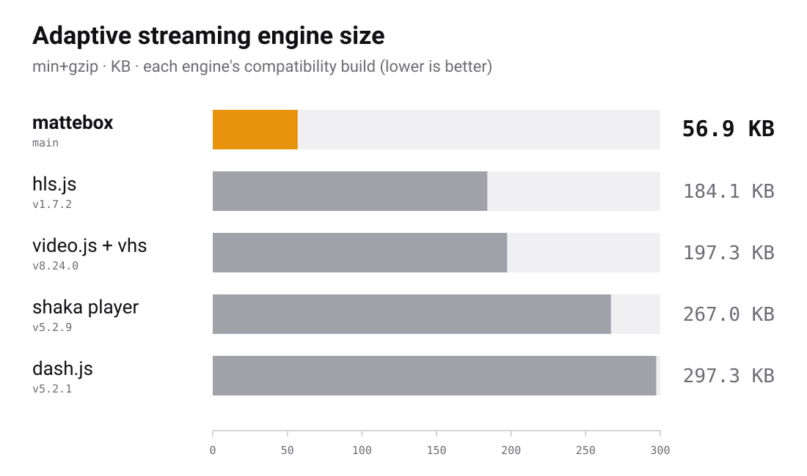

<h1>
  
  Mattebox
</h1>

[](https://github.com/jboix/mattebox/actions/workflows/quality.yml)
[](https://www.npmjs.com/package/mattebox)
[](https://nodejs.org)
[](./LICENSE)

Mattebox is a modular adaptive-streaming engine for HLS and DASH. It is a small
kernel plus stages. You add the stages you need, and the rest stays out of
your bundle. It has zero runtime dependencies and uses only
MSE, EME, and standard web platform APIs.

<picture>
  <source media="(prefers-color-scheme: dark)" srcset="docs/size-chart-dark.svg">
  
</picture>

## Quick start

Install the package:

```sh
npm install mattebox --save
```

Create an engine with the stages you need, attach it to a `<video>`
element, and load a manifest.

```ts
import { mattebox } from 'mattebox';
import hlsCmaf from 'mattebox/protocols/hls-cmaf';
import abr from 'mattebox/stages/abr';

const engine = mattebox({ stages: [hlsCmaf(), abr()] });

await engine.attach(document.querySelector('video'));
engine.load('https://example.com/stream/master.m3u8');
```

The element keeps its native API. Call `play()`, read `currentTime`, and use
the browser controls as usual.

Without a bundler, one script tag loads everything behind a `mattebox`
global with the same API.

```html
<script src="https://cdn.jsdelivr.net/npm/mattebox/dist/cdn/mattebox.min.js"></script>
<script>
  const engine = mattebox({ stages: [mattebox.hlsCmaf(), mattebox.abr()] });
</script>
```

The [guide](docs/guide/README.md) covers the rest, starting with
[Getting started](docs/guide/01-getting-started.md).

## Presets

A preset is an engine with a fixed set of stages, exported from
`mattebox/presets/<name>`:

```ts
import hls from 'mattebox/presets/hls';

const engine = hls({ config: { bufferGoalSeconds: 40 } });
```

Every preset plays on demand and live, adapts quality, recovers, switches
audio, and renders WebVTT. The name says what it adds: `-ts` for MPEG-TS
segments, `-drm` for protected content.

| Preset        | Line       | MPEG-TS | DRM |
| ------------- | ---------- | ------- | --- |
| `hls`         | HLS        |         |     |
| `hls-drm`     | HLS        |         | yes |
| `hls-ts`      | HLS        | yes     |     |
| `hls-ts-drm`  | HLS        | yes     | yes |
| `dash`        | DASH       |         |     |
| `dash-drm`    | DASH       |         | yes |
| `dual`        | HLS + DASH |         |     |
| `dual-drm`    | HLS + DASH |         | yes |
| `dual-ts`     | HLS + DASH | yes     |     |
| `dual-ts-drm` | HLS + DASH | yes     | yes |
| `full`        | HLS + DASH | yes     | yes |
| `kernel`      | none       |         |     |

`full` is the Mattebox bar in the chart above. See
[Size per preset](docs/guide/02-presets-and-stages.md#size-per-preset) for the others.

## Documentation

- [Guide](docs/guide/README.md): how to use the engine, one chapter per topic.
- [Architecture](docs/architecture.md): how the engine is built and how a stage plugs in.
- [Playground](https://jboix.github.io/mattebox/): try streams and stages in the browser.

## Contributing

See the [contributing guide](docs/CONTRIBUTING.md). Participation is governed
by the [Code of Conduct](docs/CODE_OF_CONDUCT.md). Vulnerabilities go through
[SECURITY.md](docs/SECURITY.md).

## License

MIT, see [LICENSE](LICENSE).
