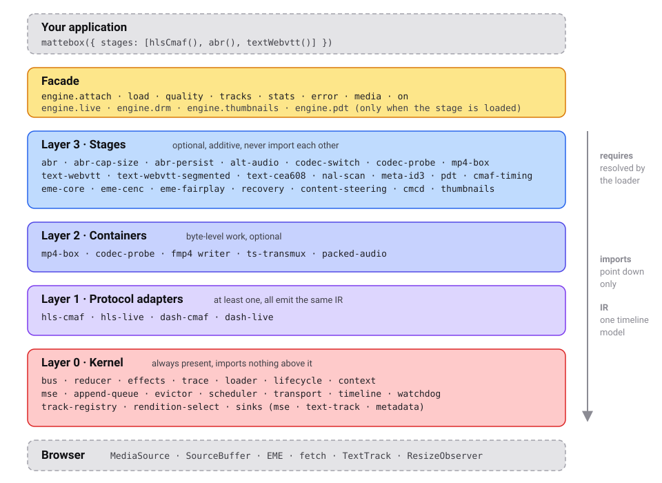

# Architecture

Mattebox is a kernel plus stages. This document lists every layer and module
and how they fit together. For usage, read the [guide](guide/README.md).



## Layers

| Layer | Role                                             | Optional     | Imports                                |
| ----- | ------------------------------------------------ | ------------ | -------------------------------------- |
| 0     | Kernel: message loop, MSE, scheduling, transport | No           | Nothing above it                       |
| 1     | Protocol adapters: manifest text to the IR       | At least one | Kernel                                 |
| 2     | Containers: byte-level work on segments          | Yes          | Kernel                                 |
| 3     | Stages: every feature                            | Yes          | Kernel, and layer 2 through `requires` |

Three rules:

- Imports point down. The kernel imports nothing from above. Stages never import each other.
- Protocol adapters emit one intermediate representation (IR). Nothing above layer 1 branches on protocol.
- The reducer is pure. Effects are plain data that a runner executes outside the loop.

## Layer 0: the kernel

The kernel alone is a working player: it attaches and plays the lowest
rendition once a protocol adapter parses a manifest.

| Module                  | Responsibility                                                                                  |
| ----------------------- | ----------------------------------------------------------------------------------------------- |
| `bus`                   | One queue for every message. Registries for sinks, parsers, transforms, and namespaces          |
| `reducer`               | Pure `reduce(state, message)` returning the next state and a list of effects                    |
| `effects`               | Runs effect descriptors through registered handlers. Results re-enter as facts                  |
| `trace`                 | The diagnostic ring buffer, its export format, and offline replay                               |
| `loader`                | Resolves `requires` into an install order. Duplicate and missing capabilities fail here         |
| `lifecycle`             | Attach and detach sequences, element listeners, stage teardown in reverse order                 |
| `context`               | The `StageContext` every stage receives at install                                              |
| `mime`                  | MIME type normalization, shared by the engine, the reducer, and the adapters                    |
| `mse`                   | MediaSource and ManagedMediaSource lifecycle, SourceBuffer creation, `changeType`               |
| `append-queue`          | Per-SourceBuffer FIFO serialized on `updateend`, quota retry                                    |
| `evictor`               | Back-buffer removal under quota pressure                                                        |
| `scheduler`             | The buffer-goal loop. Decides what to fetch next per track. Knows nothing about SourceBuffers   |
| `transport`             | Fetch wrapper with byte ranges, abort, retry, and request and response hooks                    |
| `timeline`              | Media time to presentation time. Discontinuities and period boundaries are handled the same way |
| `watchdog`              | Detects a decoder that stopped inside buffered data and reports a stall                         |
| `track-registry`        | Track enumeration and selection, the `engine.tracks` surface                                    |
| `rendition-select`      | The constraint solver behind `engine.quality`. Pins and named constraints                       |
| `sinks/mse-sink`        | Audio and video bytes to SourceBuffers                                                          |
| `sinks/text-track-sink` | Text cues to a native `TextTrack`                                                               |
| `sinks/metadata-sink`   | Timed metadata cues to a metadata `TextTrack`                                                   |

### The message loop

Five things write player state: the app, ABR, network responses, MSE
callbacks, and manifest refreshes. The bus puts them in one queue.

| Kind    | Direction                       | Can be rejected | Examples                                        |
| ------- | ------------------------------- | --------------- | ----------------------------------------------- |
| Command | In, from app or stage           | Yes             | `LOAD`, `SEEK`, `PIN_RENDITION`, `SELECT_TRACK` |
| Fact    | In, from the browser or network | No              | `SEGMENT_LOADED`, `SOURCEBUFFER_UPDATEEND`      |
| Effect  | Out, to the runner              | Not applicable  | `fetch`, `append`, `remove`, `schedule`, `emit` |

Every message and its effects go into the trace. Replaying a trace into a
fresh reducer must produce the same effects. See
[Diagnostics](guide/12-diagnostics.md).

### The IR

Every protocol adapter produces this model. Everything above layer 1 reads it.

| Type           | Holds                                                                 |
| -------------- | --------------------------------------------------------------------- |
| `Presentation` | `isLive`, `duration`, periods, couplings, live metadata, steering     |
| `Period`       | Start, duration, tracks                                               |
| `Track`        | Content type, MIME type, language, role, protection, renditions       |
| `Rendition`    | Bitrate, resolution, frame rate, codecs, init segment, segment list   |
| `Segment`      | Sequence number, start, duration, URL, byte range, discontinuity flag |
| `Coupling`     | Which audio and text tracks an HLS video rendition requires           |

Tracks carry a `protection` field even when no DRM stage is loaded, so DRM
can stay optional.

### Sinks

Text and metadata are pipelines like audio and video. Each content type has
a sink.

| Sink            | Destination                    | Content types |
| --------------- | ------------------------------ | ------------- |
| `MseSink`       | `SourceBuffer.appendBuffer`    | video, audio  |
| `TextTrackSink` | `TextTrack.addCue`             | text          |
| `MetadataSink`  | Cues on a metadata `TextTrack` | metadata      |

A track whose content type has no registered sink is listed but not
selectable.

## Layer 1: protocol adapters

| Module      | Directory                 | Responsibility                                                               | Requires    |
| ----------- | ------------------------- | ---------------------------------------------------------------------------- | ----------- |
| `hls-cmaf`  | `src/protocols/hls-cmaf`  | Multivariant and media playlists, byte ranges, keys, couplings               | kernel      |
| `hls-live`  | `src/protocols/hls-live`  | Playlist reload on the target-duration cadence, sliding window, `ENDLIST`    | `hls-cmaf`  |
| `dash-cmaf` | `src/protocols/dash-cmaf` | MPD parsing, `SegmentTemplate`, `SegmentTimeline`, `SegmentBase` with `sidx` | kernel      |
| `dash-live` | `src/protocols/dash-live` | Live window from `availabilityStartTime`, `UTCTiming`, MPD refresh           | `dash-cmaf` |

Both live adapters register `engine.live`.

## Layer 2: containers

| Module         | Directory                     | Responsibility                                                            |
| -------------- | ----------------------------- | ------------------------------------------------------------------------- |
| `mp4-box`      | `src/containers/mp4-box`      | A minimal ISOBMFF walker. Finds boxes, reads `tfdt` and `sidx`            |
| `codec-probe`  | `src/containers/codec-probe`  | Derives the exact codec string from an init segment                       |
| `fmp4`         | `src/containers/fmp4`         | Writes init and media segments. Shared by the transmuxer and packed audio |
| `ts-transmux`  | `src/containers/ts-transmux`  | MPEG-TS demux to fMP4 in a Worker. Extracts CEA-608 bytes on request      |
| `packed-audio` | `src/containers/packed-audio` | Raw AAC segments, with or without an ID3 header, wrapped as fMP4          |

`ts-transmux`, `packed-audio`, and the `aes-128` stage register a transform
step and provide `media-transform`, which routes every append through the
transform pipeline.

## Layer 3: stages

Stages group by feature. Each row is one directory under `src/stages/`.

### Quality

| Stage          | Responsibility                                                                                  | Requires                      | Namespace    |
| -------------- | ----------------------------------------------------------------------------------------------- | ----------------------------- | ------------ |
| `abr`          | Picks renditions from throughput and buffer level. Registers the chooser and an emergency floor | `scheduler`, `track-registry` |              |
| `abr-cap-size` | Caps rendition height to the element size                                                       | `rendition-select`            |              |
| `abr-persist`  | Remembers throughput across sessions through injected storage                                   | `abr`                         |              |
| `codec-switch` | Answers whether a rendition switch is seamless, needs `changeType`, or a reload                 | `mse`                         |              |
| `codec-probe`  | Publishes the codec string derived from init segments                                           | `mp4-box`                     | `codecProbe` |
| `mp4-box`      | Exposes the box walker as `engine.mp4box`                                                       |                               | `mp4box`     |

### Audio, text, and metadata

| Stage                   | Responsibility                                                          | Requires                    |
| ----------------------- | ----------------------------------------------------------------------- | --------------------------- |
| `alt-audio`             | Keeps the audio track consistent with the video rendition's audio group | `scheduler`, `codec-switch` |
| `text-webvtt`           | WebVTT parser and the text sink                                         | `scheduler`                 |
| `text-webvtt-segmented` | Applies `X-TIMESTAMP-MAP` offsets to segmented HLS subtitles            | `text-webvtt`               |
| `text-cea608`           | CEA-608 captions from SEI to a native caption track                     | `ts-transmux` or `nal-scan` |
| `nal-scan`              | Finds SEI units in fMP4 samples for CEA-608                             | `mp4-box`                   |
| `meta-id3`              | ID3 timed metadata to a metadata track                                  | `media-transform`           |

### Live

| Stage         | Responsibility                                                        | Requires   | Namespace |
| ------------- | --------------------------------------------------------------------- | ---------- | --------- |
| `pdt`         | Converts between wall clock and presentation time                     | `timeline` | `pdt`     |
| `cmaf-timing` | Rewrites `tfdt` so live CMAF segments land at their presentation time |            |           |

### Legacy HLS

| Stage     | Responsibility                                           |
| --------- | -------------------------------------------------------- |
| `aes-128` | Decrypts `METHOD=AES-128` segments before the transmuxer |

### DRM

| Stage          | Responsibility                                             | Requires   | Namespace |
| -------------- | ---------------------------------------------------------- | ---------- | --------- |
| `eme-core`     | The EME handshake, session management, ClearKey            | `mse`      | `drm`     |
| `eme-cenc`     | Widevine and PlayReady license request and response shapes | `eme-core` |           |
| `eme-fairplay` | FairPlay's SPC and CKC flow, certificate fetch             | `eme-core` |           |

### Recovery, CDN, and thumbnails

| Stage              | Responsibility                                                    | Requires           | Namespace    |
| ------------------ | ----------------------------------------------------------------- | ------------------ | ------------ |
| `recovery`         | Rendition exclusion, gap jumps, flushes, segment skips on failure | `scheduler`, `mse` |              |
| `content-steering` | Pathway priority from a steering manifest, failover               | `transport`        |              |
| `cmcd`             | Common Media Client Data on every request                         | `transport`        |              |
| `thumbnails`       | Sprite-sheet tiles from a WebVTT thumbnail track                  | `transport`        | `thumbnails` |

## Dependency rules

dependency-cruiser enforces the layering. The rules are in
`.dependency-cruiser.cjs`.

| Rule                          | Forbids                                               |
| ----------------------------- | ----------------------------------------------------- |
| `kernel-is-sovereign`         | Kernel importing protocols, containers, or stages     |
| `no-lateral-stage-imports`    | A stage importing another stage                       |
| `protocols-emit-ir-only`      | A protocol adapter importing a stage                  |
| `no-lateral-protocol-imports` | HLS adapters importing DASH adapters, and the reverse |
| `containers-are-leaf-ish`     | A container importing a protocol or a stage           |
| `no-circular`                 | Any import cycle                                      |
| `zero-runtime-deps`           | Any import from `node_modules` inside `src/`          |
| `no-orphans`                  | A module nothing imports                              |

Type-only imports count too. A stage that needs another module declares it
in `requires`, and the loader checks that at startup.

## How a stage plugs in

A stage is a factory that returns a name, what it provides, what it requires,
and an `install` function. Nothing happens at import time.

```ts
export default function myStage(): Stage {
  return {
    name: 'my-stage',
    provides: ['my-stage'],
    requires: ['scheduler'],
    install(ctx) {
      const off = ctx.on('tracks:changed', () => {});
      return () => off();
    },
  };
}
```

`install` receives a `StageContext`. Everything a stage does goes through it.

| Hook                     | Registers                                                               | Used by                         |
| ------------------------ | ----------------------------------------------------------------------- | ------------------------------- |
| `registerSink`           | A destination for a content type                                        | `text-webvtt`, `meta-id3`       |
| `registerParser`         | Bytes to cues for one MIME type                                         | `text-webvtt`, `meta-id3`       |
| `registerTransform`      | One ordered step in the segment byte pipeline                           | `ts-transmux`, `cmaf-timing`    |
| `registerNamespace`      | A public API at `engine.<name>`                                         | `eme-core`, `thumbnails`, `pdt` |
| `registerChooser`        | The rendition chooser                                                   | `abr`                           |
| `registerSwitchPolicy`   | Whether a rendition switch is seamless, needs `changeType`, or a reload | `codec-switch`                  |
| `reduce`                 | A named state slice with its own pure reducer                           | protocol adapters, `recovery`   |
| `addRequestHook`         | Sees and rewrites outgoing requests                                     | `cmcd`, `content-steering`      |
| `request`                | A one-off fetch through the transport                                   | `eme-core`, `thumbnails`        |
| `dispatch`, `on`, `emit` | Commands in, events out                                                 | every stage                     |

The lifecycle:

1. `mattebox()` resolves `requires` and orders the stages.
2. `attach()` installs each stage against the element, in that order.
3. `detach()` runs every teardown in reverse order and clears the element.

Transforms run in ascending `order`: decryption first, the transmuxer at
100, caption extraction and timing fixes at 150.

## See also

- [Guide](guide/README.md) for usage.
- [Presets and stages](guide/02-presets-and-stages.md) for building your own stack.
- [Diagnostics](guide/12-diagnostics.md) for the trace and replay.
