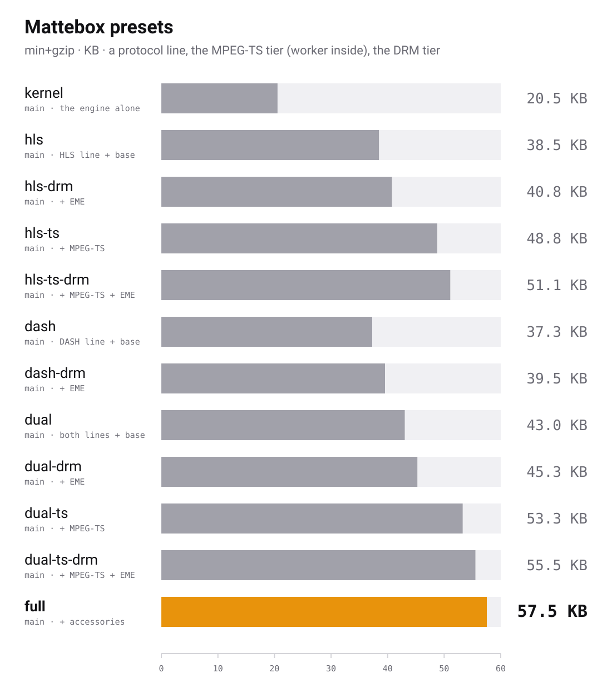

# 02 Presets and stages

This chapter covers stages, presets, and how to build your own stack.

## Stages

A stage is a plugin. It has a name, can provide capabilities, can require
other stages, and installs when you call `attach`. Importing a stage does
nothing on its own, and stages never import each other.

The kernel is not a stage. It is always present and is a working player on
its own.

## Import paths

Every stage has its own import path.

| Import path                  | Layer      | Examples                                         |
| ---------------------------- | ---------- | ------------------------------------------------ |
| `mattebox/protocols/<name>`  | Protocols  | `hls-cmaf`, `hls-live`, `dash-cmaf`, `dash-live` |
| `mattebox/containers/<name>` | Containers | `ts-transmux`, `packed-audio`                    |
| `mattebox/stages/<name>`     | Stages     | `abr`, `text-webvtt`, `eme-core`, `recovery`     |

```ts
import hlsCmaf from 'mattebox/protocols/hls-cmaf';
import tsTransmux from 'mattebox/containers/ts-transmux';
import abr from 'mattebox/stages/abr';
```

## Stage requirements

Some stages require others. `text-webvtt-segmented` needs `text-webvtt`.
`eme-cenc` needs `eme-core`. `alt-audio` needs `codec-switch`. The engine
resolves these when you call `mattebox()` and fails with a clear error when
one is missing.

```ts
mattebox({ stages: [textWebvttSegmented()] });
// Error: 'text-webvtt-segmented' requires 'text-webvtt', which nothing provides
```

Order in the array does not matter. The loader installs stages in dependency
order.

Two stages that provide the same capability cannot be loaded together. Two
WebVTT parsers is an error.

## Feature detection

A stage with a public API adds a property on the engine. Stages that are
not loaded add nothing, so use `in` to check.

```ts
if ('live' in engine) {
  engine.live.seekToEdge();
}
```

`engine.capabilities()` lists what is loaded.

```ts
console.log([...engine.capabilities()]);
// ['hls-cmaf', 'application/vnd.apple.mpegurl', 'abr', ...]
```

## Presets

A preset is a factory that returns an engine with a fixed set of stages.
Import one from `mattebox/presets/<name>` and call it.

```ts
import hls from 'mattebox/presets/hls';

const engine = hls();
await engine.attach(video);
engine.load(url);
```

Pick by protocol, whether you have MPEG-TS segments, and whether content is
protected.

| Preset        | Line       | MPEG-TS | DRM |
| ------------- | ---------- | ------- | --- |
| `hls`         | HLS        |         |     |
| `hls-drm`     | HLS        |         | yes |
| `hls-ts`      | HLS        | yes     |     |
| `hls-ts-drm`  | HLS        | yes     | yes |
| `dash`        | DASH       |         |     |
| `dash-drm`    | DASH       |         | yes |
| `dual`        | HLS + DASH |         |     |
| `dual-drm`    | HLS + DASH |         | yes |
| `dual-ts`     | HLS + DASH | yes     |     |
| `dual-ts-drm` | HLS + DASH | yes     | yes |
| `full`        | HLS + DASH | yes     | yes |
| `kernel`      | none       |         |     |

Every preset except `kernel` includes the same base: on
demand and live playback, adaptive quality with a size cap and bandwidth
memory, recovery, content steering, alternate audio with codec switching,
WebVTT subtitles, and CMAF live timing. The HLS lines add program date time
and AES-128 segment decryption.
`-ts` adds the transmuxer, packed audio, CEA-608 captions, and ID3
metadata. `-drm` adds the three EME stages. `full` is `dual-ts-drm` plus the
four stages below, and `kernel` is nothing, for a stack you build
by hand.

Four stages are only in `full`. Add them with `stages` when you need them.

| Stage                                    | Why                                                                                            |
| ---------------------------------------- | ---------------------------------------------------------------------------------------------- |
| `thumbnails`                             | Needs a sprite track URL from your app                                                         |
| `cmcd`                                   | Changes every request to the CDN, so it is opt-in                                              |
| `mp4-box`, `codec-probe`                 | Reads codecs from the init segment when the playlist declares none                             |
| `nal-scan`, `text-cea608` on a CMAF line | Scans the video bitstream for captions. The `-ts` presets get them from the transmuxer instead |

A preset takes the same `config` and `transport` options as `mattebox()`,
plus two more. `stages` merges by name: a stage the preset already has is
replaced, which is how you pass it options, and any other stage is appended.
`without` removes stages by name.

```ts
import hls from 'mattebox/presets/hls';
import recovery from 'mattebox/stages/recovery';
import thumbnails from 'mattebox/stages/thumbnails';

const engine = hls({
  config: { bufferGoalSeconds: 40 },
  stages: [recovery({ skipAfter: 2 }), thumbnails()], // recovery replaced, thumbnails added
  without: ['content-steering'],
});
```

Removing a stage that another stage requires throws, with both names in the
message. `stages()` on the preset returns the stage list with the same merge
applied, if you want to reorder it or build on it yourself.

```ts
const stack = hls.stages({ without: ['pdt'] });
const engine = mattebox({ stages: [thumbnails(), ...stack] });
```

Every preset stores the measured bandwidth in `localStorage` for the next
session. If storage is missing or throws, nothing is stored. Pass
`abrPersist(yourStorage)` in `stages` to store it elsewhere. The `-drm`
presets load `eme-core` with no license server. Set one with
`engine.drm.setLicenseUrl` before loading, or pass `emeCore({ ... })` in
`stages`.

## Size per preset

Every preset, min+gzip, one file each. The `-ts` presets and `full` carry
the transmux Worker inside.

<picture>
  <source media="(prefers-color-scheme: dark)" srcset="../preset-chart-dark.svg">
  
</picture>

## Kernel config

`mattebox()` also takes `config` and `transport`. Every option has a default.

```ts
const engine = mattebox({
  stages: [hlsCmaf(), abr()],
  config: {
    bufferGoalSeconds: 30,
    backBufferSeconds: 20,
    traceCapacity: 1000,
  },
});
```

| Option              | Meaning                                                |
| ------------------- | ------------------------------------------------------ |
| `bufferGoalSeconds` | Forward buffer the scheduler aims for                  |
| `backBufferSeconds` | Media kept behind the playhead under quota pressure    |
| `manifestTimeoutMs` | Timeout for the manifest fetch                         |
| `traceCapacity`     | Entries kept in the diagnostic ring buffer             |
| `bufferErrorLimit`  | Consecutive SourceBuffer failures before a fatal error |

Transport options are covered in [chapter 11](11-network-and-cdn.md).

## Example

HLS and DASH on demand, with ABR and subtitles.

```ts
import { mattebox } from 'mattebox';
import dashCmaf from 'mattebox/protocols/dash-cmaf';
import hlsCmaf from 'mattebox/protocols/hls-cmaf';
import abr from 'mattebox/stages/abr';
import abrCapSize from 'mattebox/stages/abr-cap-size';
import textWebvtt from 'mattebox/stages/text-webvtt';
import textWebvttSegmented from 'mattebox/stages/text-webvtt-segmented';

const engine = mattebox({
  stages: [
    hlsCmaf(),
    dashCmaf(),
    abr(),
    abrCapSize(),
    textWebvtt(),
    textWebvttSegmented(),
  ],
});
```

Next: [03 HLS and DASH](03-hls-and-dash.md).
